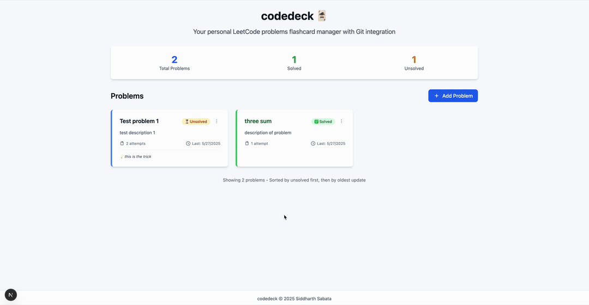

# codedeck - LeetCode Flashcards App

A modern, personal web application for managing LeetCode problems as interactive flashcards with integrated Git tracking for your coding attempts.


<div align="center">
  
</div>

## 🚀 Quick Start

```bash
# 1. Clone the repository
git clone https://github.com/siddsabata/codedeck.git
cd codedeck

# 2. Copy and configure environment
cp env.example .env
# Edit .env with your GitHub token and Git repository path

# 3. Run the startup script (handles database setup automatically)
./docker-start.sh
```

The script will start the application at [http://localhost:3000](http://localhost:3000)

## 📋 Table of Contents

- [Quick Start](#quick-start)
- [Overview](#overview)
- [Features](#features)
- [Tech Stack](#tech-stack)
- [Prerequisites](#prerequisites)
- [Installation](#installation)
- [Usage](#usage)

## 🎯 Overview

CodeDeck transforms your LeetCode practice into an organized, trackable experience. Instead of losing track of problems you've worked on, CodeDeck lets you:

- **Organize problems as flashcards** with descriptions, tricks, and personal notes
- **Track your coding attempts** with automatic Git integration
- **Store and view your Python solutions** with syntax highlighting
- **Mark problems as solved** and track your progress
- **Review your approach** with editable trick summaries and notes

Perfect for developers who want to maintain a personal knowledge base of coding problems and solutions.

## ✨ Features

### 🃏 **Problem Management**
- Create and organize LeetCode problems as interactive flashcards
- Add detailed descriptions, trick summaries (50-word limit), and personal notes
- Mark problems as solved/unsolved with visual status indicators
- Sort problems by completion status and last activity

### 💻 **Code Tracking**
- Store Python code attempts with automatic Git integration
- View historical code versions for each attempt
- Automatic commit creation with descriptive messages
- GitHub integration with Personal Access Token authentication

### 🎨 **Modern UI/UX**
- Responsive design that works on desktop, tablet, and mobile
- Smooth animations powered by Framer Motion
- Toast notifications for user feedback
- Inline editing for trick summaries and notes
- Syntax highlighting for code viewing

## 🛠 Tech Stack

**Frontend:**
- **Next.js 15.3.2** - React framework with API routes
- **React 19.1.0** - UI library
- **TypeScript 5.8.3** - Type safety
- **Tailwind CSS 4.1.7** - Utility-first CSS framework
- **Framer Motion 12.14.0** - Smooth animations
- **SWR 2.3.3** - Data fetching and caching

**Backend:**
- **Next.js API Routes** - Serverless API endpoints
- **Prisma 6.8.2** - Database ORM and migrations
- **SQLite** - Lightweight database
- **simple-git 3.27.0** - Git integration

**Development:**
- **Docker & Docker Compose** - Containerized development
- **ESLint** - Code linting
- **react-hot-toast** - Toast notifications

## 📋 Prerequisites

Before installing CodeDeck, ensure you have:

1. **Docker and Docker Compose** installed on your system
2. **Git** installed and configured
3. **GitHub Personal Access Token** with repository permissions
4. **A Git repository** for storing your LeetCode attempts

## 🚀 Installation

### First-Time Setup

CodeDeck requires a **separate Git repository** to store your LeetCode attempt files. This is where your Python solutions will be automatically committed and tracked.

#### Step 1: Prepare Your Attempts Repository

**Create a new Git repository for your LeetCode attempts:**

```bash
# Create a new directory for your attempts
mkdir my-leetcode-attempts
cd my-leetcode-attempts

# Initialize as Git repository
git init

# Create initial commit
echo "# My LeetCode Attempts" > README.md
git add README.md
git commit -m "Initial commit"

# Add remote (replace with your GitHub repo URL)
git remote add origin https://github.com/yourusername/my-leetcode-attempts.git
git push -u origin main
```

**Important**: 
- This repository is **separate** from the CodeDeck application
- CodeDeck will create files like `attempts/problem-1/attempt.py` in this repository
- Each attempt gets automatically committed and pushed to this repository

#### Step 2: Get GitHub Personal Access Token

1. Go to [GitHub Settings > Developer settings > Personal access tokens](https://github.com/settings/tokens)
2. Click "Generate new token (classic)"
3. Give it a name like "CodeDeck Access"
4. Select scopes: `repo` (Full control of private repositories)
5. Click "Generate token"
6. **Copy the token** - you'll need it in the next step

#### Step 3: Install CodeDeck

```bash
# Clone CodeDeck application
git clone https://github.com/siddsabata/codedeck.git
cd codedeck

# Make scripts executable (required for new installations)
chmod +x docker-start.sh test-setup.sh scripts/init-db.sh

# Copy environment template
cp .env.example .env
```

#### Step 4: Configure Environment

Edit `.env` with your actual values:

```bash
# Database (for Docker - uses absolute container path)
DATABASE_URL="file:/app/prisma/dev.db"

# Your GitHub Personal Access Token (from Step 2)
GITHUB_PAT="ghp_your_actual_token_here"

# ABSOLUTE path to your attempts repository (from Step 1)
GIT_REPO_PATH="/Users/yourusername/my-leetcode-attempts"

# Your Git identity for commits
GIT_USER_NAME="Your Full Name"
GIT_USER_EMAIL="your.email@example.com"
```

**Critical**: 
- `DATABASE_URL` uses Docker container path format (automatically handled)
- `GIT_REPO_PATH` must be the **absolute path** to your attempts repository
- Use the full path like `/Users/yourusername/my-leetcode-attempts` (not relative paths)

#### Step 5: Start CodeDeck

```bash
# Run the startup script (handles everything automatically)
./docker-start.sh
```

The script will:
- ✅ Validate your environment configuration
- ✅ Check that your Git repository exists
- ✅ **Automatically create and initialize database** with Prisma migrations
- ✅ Start the application in development mode on port 3000
- ✅ Begin with an empty database ready for your problems

Wait for the startup to complete, then open [http://localhost:3000](http://localhost:3000)

**🎉 That's it!** Your database is created automatically with proper schema and you can start adding your own problems.

### Daily Usage

After the first-time setup, starting CodeDeck is simple:

```bash
# Navigate to CodeDeck directory
cd codedeck

# Run the startup script
./docker-start.sh
```

**That's it!** The script will:
- ✅ Validate your environment is still configured correctly
- ✅ Start the web interface at http://localhost:3000
- ✅ Connect to your attempts repository
- ✅ Use your existing database (preserves all your data)

### Database Management

**Automatic Setup**: The database is created automatically on first run using Prisma migrations.

**Your Data**: All your problems, attempts, and progress are automatically saved and persist between sessions.

**Fresh Start**: Delete your database file to start completely fresh, or delete individual problems through the UI.

### Stopping the Application

To stop CodeDeck when you're done:

```bash
# If running in foreground (you see logs), press:
Ctrl + C

# If running in background, stop with:
docker-compose down
```

The application will shut down gracefully and your data will be preserved.

### How It Works

1. **You solve a LeetCode-style problem**
2. **You create a problem card** in CodeDeck with the problem details
3. **You add an attempt** by pasting your Python solution
4. **CodeDeck automatically**:
   - Creates `attempts/problem-X/attempt.py` in your attempts repository
   - Commits the file with a descriptive message
   - Pushes to your GitHub repository
   - Tracks the commit hash for viewing later

### Troubleshooting

**Environment Issues**:
- Run `./docker-start.sh` - it will validate your configuration and guide you through fixes
- The script checks for common issues like missing `.env`, invalid paths, and placeholder values

**Database Issues**:
- Database creation is **fully automatic** - no manual setup required
- The database will be created automatically when you start the application

**"Git repository not found"**: 
- The startup script will offer to create the repository for you
- Verify `GIT_REPO_PATH` is the absolute path to your attempts repository
- Make sure the directory exists and is a Git repository (`git status` should work)

**"Authentication failed"**: 
- Check your `GITHUB_PAT` is correct and has `repo` permissions
- Ensure your attempts repository remote URL is correct

**"Permission denied"**: 
- Make sure Docker can access your attempts repository directory
- On macOS/Linux, the path should be under your home directory

**Testing Your Setup**:
```bash
# Run this to test your setup without starting the full app:
./test-setup.sh
```

**Fresh Installation**: If you're setting up on a new machine, simply:
1. Clone the repo
2. Make scripts executable: `chmod +x docker-start.sh test-setup.sh scripts/init-db.sh`
3. Copy and configure `.env`  
4. Run `./docker-start.sh`
5. Everything else is automatic!

## 📖 Usage

### Getting Started

1. **Create your first problem:**
   - Click "Add Problem" on the main page
   - Enter the problem name and description
   - Save to create your first flashcard

2. **Add attempt with code:**
   - Click on a problem card to view details
   - Click "Add Attempt" 
   - Paste your Python solution code
   - Add optional notes about your approach
   - Save to automatically commit to your Git repository

3. **Edit problem details:**
   - Click on any problem to view its detail page
   - Edit trick summaries and notes inline
   - Toggle solved status when you complete a problem

4. **View your code:**
   - Click "View Code" on any attempt to see your solution
   - Copy code to clipboard with one click
   - View historical versions of your solutions

## 🙏 Acknowledgments

Built with modern web technologies:
- [Next.js](https://nextjs.org/) - React framework
- [Tailwind CSS](https://tailwindcss.com/) - Utility-first CSS
- [Framer Motion](https://www.framer.com/motion/) - Smooth animations
- [Prisma](https://www.prisma.io/) - Database toolkit

---

**Happy coding! 🚀**

For questions or support, please open an issue on GitHub. 